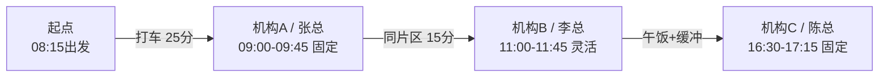

# Output Formats

Use these formats when preparing a route. Adapt labels to the user's city and style, but keep the operational information visible.

## Address Confirmation

| 序号 | 机构 | 联系人 | 高德/地图候选 | 官网核验地址 | 片区 | 状态 |
| --- | --- | --- | --- | --- | --- |
| 1 | 机构名 | 张总 | 某大厦/路名 | 官网联系我们/公司概况披露地址 | 金融街 | 待确认/已确认 |

If an address is ambiguous, list the likely candidates and ask the user or sales to choose before final routing.

When addresses are missing, run `scripts/address_lookup.py` first and include a confirmation prompt:

`我先查到这些地址，你看哪家不对直接说，特别是最近搬过家的。`

Then search the official website. If a likely official contact/company page is found, run `scripts/official_address_check.py --url ... --candidate ...` and include the official snippet or a short source note.

For unresolved institutions, write `待人工确认`; do not invent a location. Never use copied sample addresses, screenshot addresses, or stale notes as route-planning evidence.

## Route Sequence Diagram

Use a route sequence diagram/card before the detailed table so the user can understand the day at a glance.

One-line route card for normal chat:

`起点 08:15 -> 机构A/张总 09:00固定 -> 机构B/李总 11:00灵活 -> 午饭/缓冲 -> 机构C/陈总 16:30固定 -> 终点`

For higher-polish output, or when the user asks for a visual route order, include a Mermaid flowchart if the interface supports it:



Rules:

- Keep the diagram to route order, time anchors, and travel durations. Put addresses and caveats in the table.
- Mark fixed meetings as `固定`; mark flexible meetings as `灵活` or `窗口`.
- If the output must be short, the route card can replace the long table only when all times are already confirmed and there are no unresolved risks.
- If there are unresolved address or timing issues, keep both the route card and the table so assumptions remain visible.

## Itinerary

Title line:

`YYYY年M月D日（周X）路演行程`

Context line:

`酒店/起点：...；终点/硬约束：...；偏好：效率优先/体力优先/...`

Route card:

`起点 -> 机构A（固定09:00） -> 机构B（灵活，XX点） -> 午饭/缓冲 -> 机构C（固定16:30） -> 终点`

Table:

| 时间 | 安排 | 地点/联系人 | 交通与耗时 | 状态 | 备注 |
| --- | --- | --- | --- | --- | --- |
| 08:15 | 酒店出发 | 起点 | 步行/地铁/打车 X 分钟 | - | 预留进楼时间 |
| 09:00-09:45 | 机构A | 经确认地址，张总 | - | 固定 | 45分钟 |
| 09:45-10:05 | 转场 | 至机构B | 步行/打车/地铁 X 分钟 | - | 同片区，保留缓冲 |

After the table, include:

- 路线：酒店 -> 片区A -> 片区B -> 片区C -> 终点
- 统计：拜访 X 场；地铁 X 段；打车 X 段；步行/换乘风险；预计交通耗时；折返 X 次
- 体力安排：午饭、休息、咖啡/邮件 buffer、连续会议后的恢复点
- 风险提示：地址未确认、早高峰拥堵、安检/登记、高跟鞋/行李/天气

## Why This Order

Keep this short and practical:

1. 先固定不可动的会议。
2. 同片区客户尽量连在一起。
3. 把灵活客户插进固定会议之间的自然空档。
4. 对高价值固定会议预留更长 buffer。
5. 按用户状态选择交通，而不是机械追求最短时间。

## Optimization Evidence

Include this block when `amap_route_optimizer.py` or another route enumeration is used:

- 最优性说明：写清楚本次是 `精确枚举`、`启发式降级`，还是 `人工估算`。只有检查了所有候选顺序时，才可以说“在当前输入约束下为全局最优顺序”。
- 数据来源：高德用于单段 taxi/transit 路线和耗时；skill 用这些单段结果做全局顺序枚举。
- 枚举范围：检查 X 种顺序；固定会议/窗口/午餐约束是否全部满足。
- 胜出路线：A -> B -> C，原因是固定会议安全、总交通少、少走路/少折返。
- 备选路线：列 1-3 条被淘汰的主要备选，说明被淘汰原因，如固定会前 buffer 不足、超过灵活窗口、折返、步行过多。
- 注意措辞：不要写“高德推荐整天顺序”；写“高德提供单段路线，skill 基于单段结果做全局规划”。

Compact wording:

`路线来源：本次用高德实时拉取各点两两打车/公共交通耗时，skill 枚举 X 种拜访顺序后选择 A -> B -> C。不是高德一键推荐整天行程，而是高德单段路线 + skill 全局约束优化。`

## If Infeasible

When no safe route fits all meetings, do not hide the conflict. Say:

- 哪一场冲突
- 冲突来自固定时间、交通、午饭还是缓冲
- 两到三个可选方案：压缩会议时长、调整灵活客户、放弃午饭/缩短休息、请销售改约、拆成线上/改日

## Quick Example Skeleton

```
初步判断：这版可以排，但需要确认机构B官网地址与高德候选是否一致。

YYYY年M月D日（周X）北京路演行程
起点：酒店/公司；偏好：上午效率优先、下午体力优先

| 时间 | 安排 | 地点/联系人 | 交通与耗时 | 状态 | 备注 |
| ... |

路线逻辑：先处理固定场次，再把同片区灵活拜访插入自然空档，尽量减少折返。
需要确认：机构B官网地址与高德候选是否一致；最后一场是否必须16:30。
```
